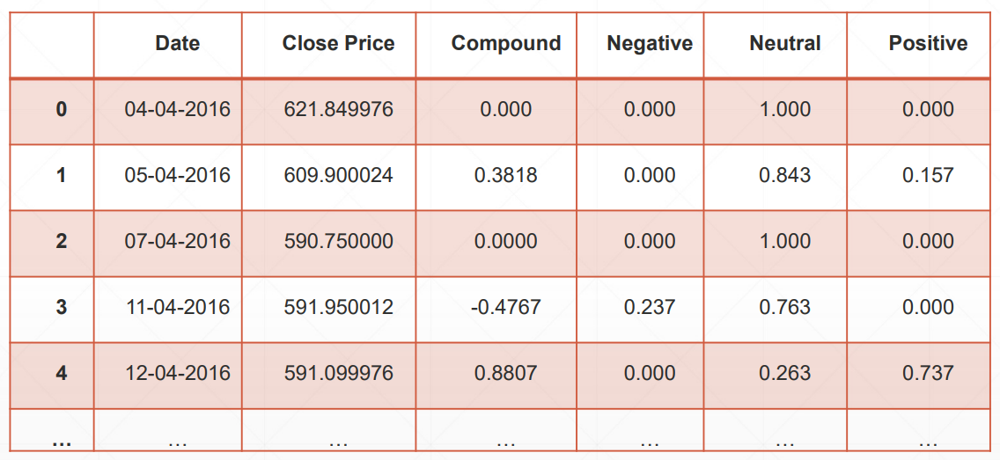
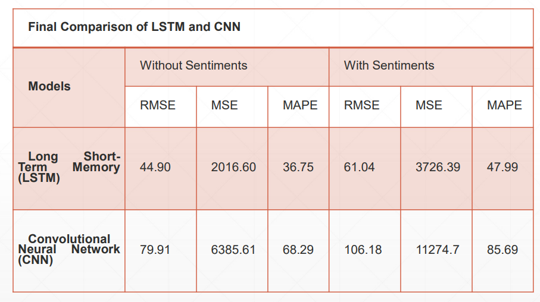

# Comparision of various ML Models for Stock Price Prediction 

## Introduction:
Predicting stock price of Infosys stock using sentiments gathered from newsheadlines. 
Comparing CNN and LSTM models for prediction. 
Finding out whether news headlines affects the price.

## Problem Statement
News headlines have a great impact on people while making their tradingdecisions. Many people don’t have much time or tend to avoid reading the wholenews and just take a buy or sell call on the basis of the headlines. ▪ There is a common belief that if the news is positive then more people areattracted to invest and therefore the stock price of that particular company mayrise and vice-versa.

Case 1: Infosys shares at record high after winning billion-dollar deal from Daimler AG (Date:
23 December, 2020) \
Type: Positive News Result: Change in price 2.31% positive

Case 2: CBI charges DHFL founders with fraud in Pradhan Mantri Awas Yojana (Date: 24
March, 2021) \
Type: Negative news Result: Change in price 4.87% negative

## Proposed System

1. First, the historical data of INFOSYS was collected from yahoo finance. The dataset
contained data from 01-04-2016 to 01-04-2021. ▪ 
2. Scraping news data of INFOSYS from google news using Google News API in Python
and storing it in a CSV file. 
3. Perform sentiment analysis on news headlines using the NLTK module of python for
natural language processing and VADER Lexicon. 
4. After performing a sentiment analysis of news headlines, we got the polarity score
(compound, negative, neutral, positive). 
5. Then, we merged the final output of sentiment analysis with the historical stock data
to get the final dataset for evaluation of models. The final dataset after considering
required fields is shown in table.

")

")

## Results 

")

")

## Conclusion:

LSTM gives better results in comparison to CNN.
A weak correlation was found between sentiments and closing price as the data gathered is not perfect. 
To increase the performance of models, it is required that the sentiments gathered are accurate which requires human intervention or advance preprocessing of data to overcome the limitations of API. 
Further, the same implementation can be carried out on stocks of different sectors to reach a definite conclusion. 
Also, hybrid models can be made of LSTM and CNN to increase the performance.